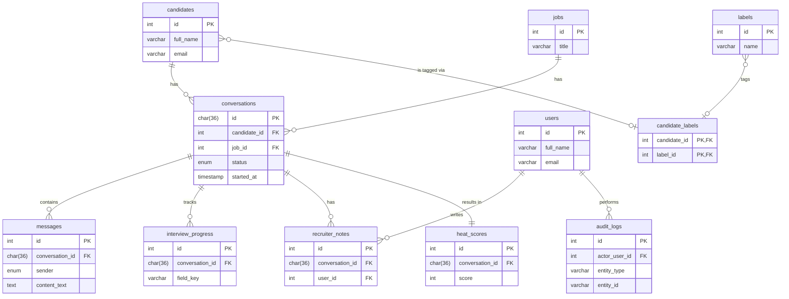

# Architecture Overview

This document provides a high-level overview of the Recruiter-AI system architecture, starting with the database schema.

## Entity Relationship Diagram (ERD)

The following diagram illustrates the relationships between the core entities in the database.

## Database Standards

*   **Character Set & Collation**: All tables are created with the `utf8mb4` character set and `utf8mb4_unicode_ci` collation. This is crucial for ensuring full support for all Unicode characters, which is a requirement for handling candidate data and conversations in multiple languages, especially Hebrew.

*   **Foreign Keys & Cascade Rules**:
    *   **`ON DELETE CASCADE`**: This rule is used for relationships where child entities are intrinsically tied to a parent and cannot exist independently. For example, when a `conversation` is deleted, all of its associated `messages`, `interview_progress`, `heat_scores`, and `recruiter_notes` are automatically deleted. This ensures data integrity and prevents orphaned records.
    *   **`ON DELETE SET NULL`**: This rule is applied to the `actor_user_id` in the `audit_logs` table. If a user account is deleted, their ID in the audit log is set to `NULL` instead of deleting the log entry. This preserves the history of actions performed in the system while still allowing for user data to be removed.

*   **Primary Keys**: Standard tables use an auto-incrementing integer (`id`) as the primary key. The central `conversations` table uses a `CHAR(36)` to store a UUID, which is generated by the application. This allows for unique, non-sequential identifiers for interview links that are safe to expose externally.

*   **Timestamps**: All tables include a `created_at` column with a `DEFAULT CURRENT_TIMESTAMP` value, which automatically records the creation time of each record. This is essential for auditing and tracking data lifecycles.
