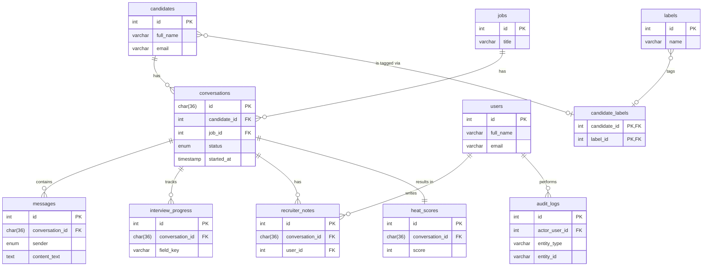

# Entity Relationship Diagram

This document provides a visual overview of the database schema using a Mermaid ERD.

*Note: This file contains the Mermaid source code for the diagram. A separate process can be used to export this to a PNG or SVG if a static image is required.*

